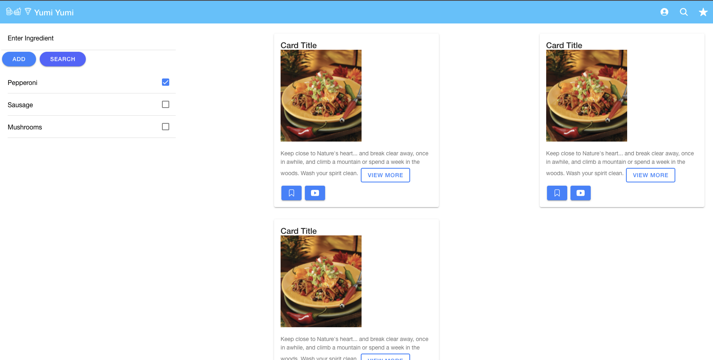

# Project-Yumi-Yumi

## Search Page

Hi team, this is my mockup for the search page, in the logo I use 3 different icons provided by ionic that I think match with the title of the project(food).

## Subject to improve:

-I'm not sure about the colors but we can check it later.
-I added 2 buttons to mark the recipe to favorite and the youtube link. Any comments?
-I'm not sure either about the add and search for the recipe, we can discuss it later to improve and to start with the functionality.

## User Story

```
AS A user
I WANT to enter different ingredients
SO THAT I can search for a recipie to cook.
```

## Mock-Up

The following image shows the search appearance :


