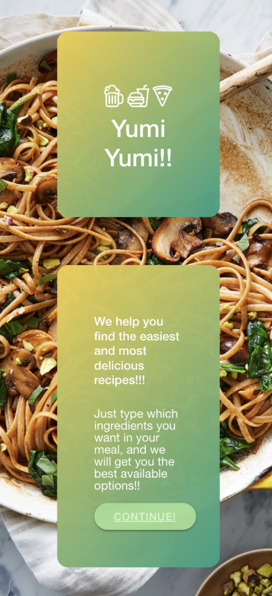
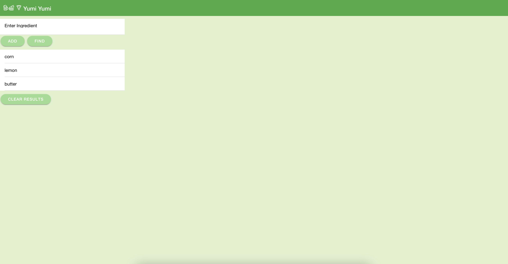
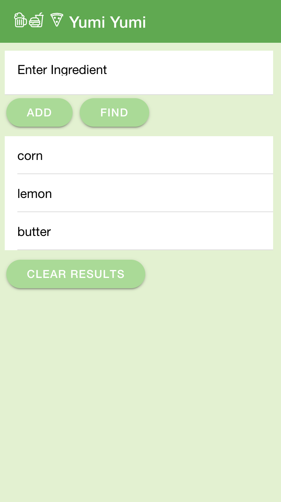
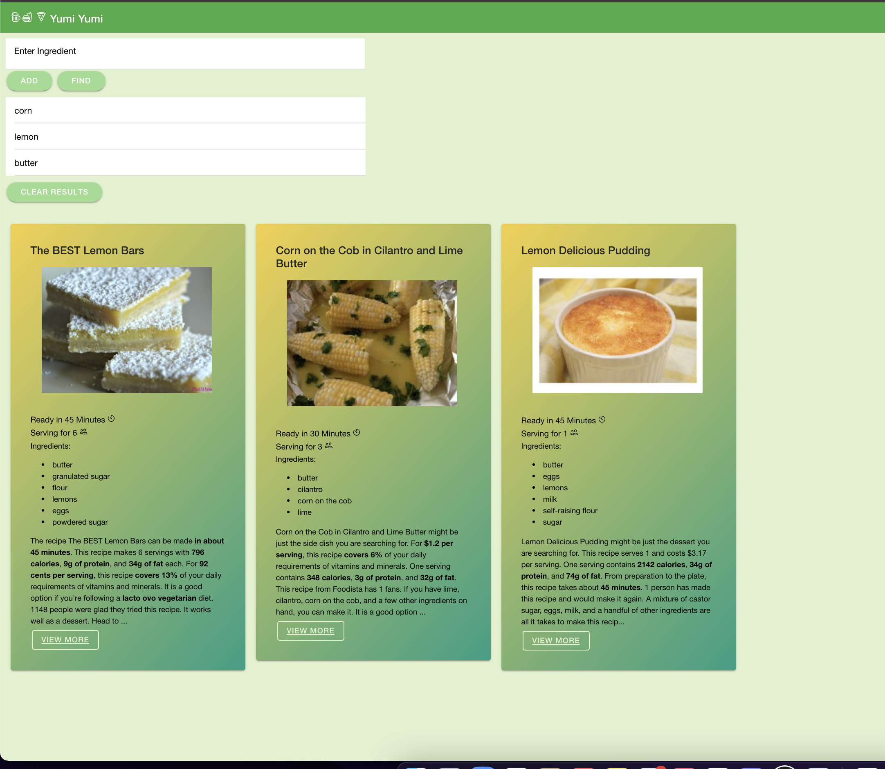
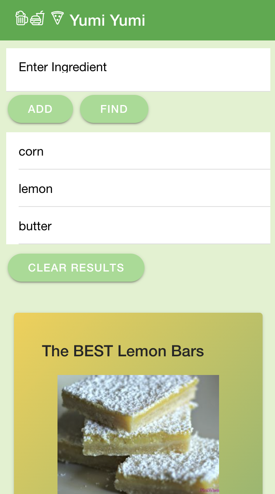
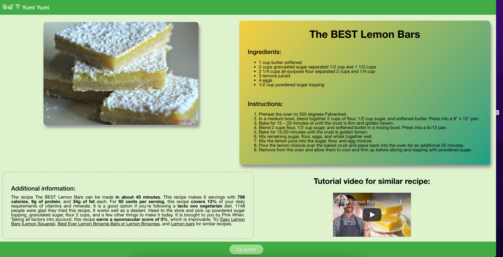
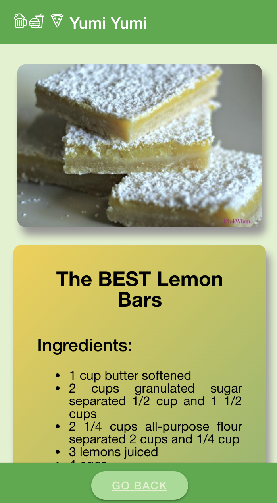

# Yumi Yumi Project

https://ireyesleon.github.io/Project-Yumi-Yumi/

## Description of the Project

This is an application to add ingredients and find a recipe that suits all or most of all ingredients added.

The technologies used in this project are:

- Vanilla Javascript
- Ionic as a CSS framework (https://ionicframework.com/docs)
- Spoonacular API (https://spoonacular.com/food-api/docs)
- Youtube API (https://developers.google.com/youtube/v3/)

The project is reaching information with the API Spoonacular to find the recipes with most of all ingredients introduced by the user. The free plan includes only 150 requests per day to the server.
With the information received we use the title of the recipe to call Youtube API to search for a video that is similar to the title of the recipe and show it in the information recipe.

The devolopers involve in this project are:

- Isaias Reyes Leon
- Jose Enrique Jimenez Rojas
- Mariana Gonzalez Romero

## User Story

```
AS A user
I WANT to add ingredients
SO THAT I can research the best recipe to cook
SO THAT I follow the instruction and
I WANT to have the option to see a youtube video to cook a similar recipe.
```

## Acceptance Criteria

```
WHEN I am presented with the landing page
THEN I can see the objective of the application (find the easiest recipe with the ingredients you want in it)
THEN I press the CONTINUE button
GIVEN a recipe dashboard with an input (to enter an ingredient) and different buttons (ADD, FIND, and CLEAR RESULT)
GIVEN input I write an ingredient
THEN I press the button ADD and this ingredient is added to a list
THEN I can search the recipe whit all these ingredients and press FIND button
THEN I am presented with different recipes cards
THEN I view the recipe information with the preparation time, the servings, the ingredients, and additional information.
THEN I press the button SEE MORE in the recipe card
THEN I see the measures ingredients, the instructions to cook the meal, the complete additional information and a youtube video to cook a similar recipe, and a button to go back to the recipe dashboard.
WHEN I press GO BACK button I see the recipe dashboard again.
```

## Mock-Up

The following image shows the web application's appearance and functionality:

- Landing page
  
  

- Recipe Dashboard before the find a recipe
  
  

- Recipe Dashboard after the find a recipe with different meals to prepare
  
  

- Recipe information with all the instructions, measures, additional information and the yourube video
  
  
